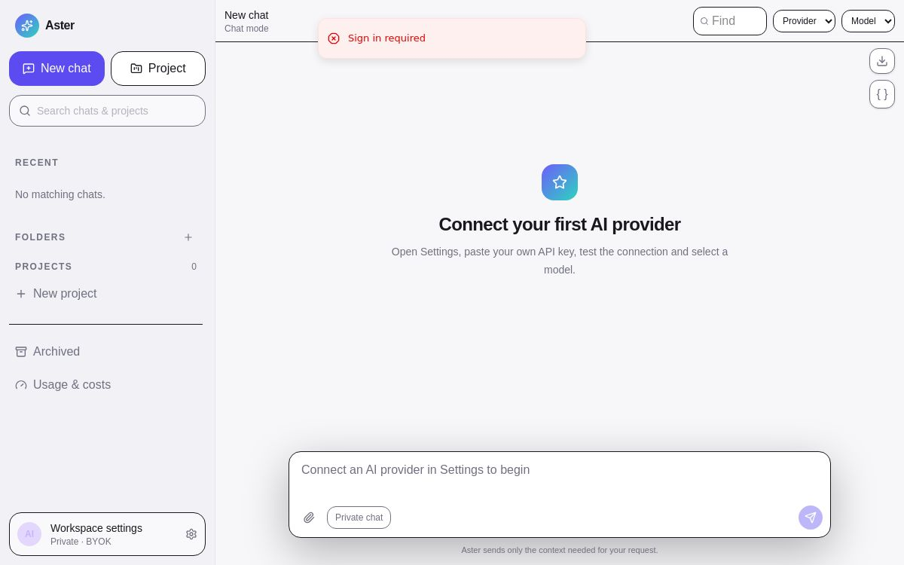

# Astrid Workspace


Astrid is a private, self-hostable AI workspace that keeps conversation and source code in separate surfaces. It combines multi-provider BYOK chat, persistent projects, a Monaco-based coding workspace, structured AI file operations, cost tracking, memory, uploads, Git-style snapshots, exports, and an installable mobile PWA.

The software is provider-neutral. Users supply their own AI accounts and keys, own their data, and choose where to deploy it.

## Screenshot



The hosted instance is private by design: [open Astrid Workspace](https://astrid-workspace.toppa.chatgpt.site). A signed-in owner then completes provider setup inside the app.

## Highlights

- ChatGPT-style chat and project sidebar with folders, pinning, archive, search, rename, move, and drag-to-project behavior
- Mobile-first voice composer with microphone cleanup, editable transcripts, English/Afrikaans hints, custom vocabulary, and server-side `gpt-transcribe`
- Resizable desktop layout: sidebar, chat, and IDE; separate Chat/Code views on mobile
- Real streaming adapters for OpenAI, Anthropic, Google Gemini, xAI, OpenRouter, Ollama, LM Studio, and custom OpenAI-compatible endpoints
- Dynamic model discovery instead of a hardcoded model list
- Settings-based model menu: all discovered models remain available while the chat selector defaults to a concise curated set
- Manual model selection and optional Smart/Balanced routing across connected providers
- Capability-aware model details and provider-specific reasoning effort controls
- AES-GCM encrypted provider keys; the client receives only masked key hints
- Monaco editor, file tree, unsaved state, file operations, syntax highlighting, and side-by-side diffs
- Structured `create_file`, `update_file`, `delete_file`, and `rename_file` AI operations
- Apply/Reject per change, Apply All/Reject All, and optional automatic application
- Automatic coding-intent routing: build requests become projects before the provider is called, so source is staged in the IDE instead of dumped into chat
- Optional desktop folder mirroring through the browser File System Access API (Chrome/Edge)
- Encrypted GitHub connection with real repository creation and snapshot commits
- Relevant-file selection, conversation compaction, project summaries, and scoped memory
- Token/cost ledger, budget tracking, provider/model usage dashboard, and response-level usage
- R2-backed uploads, project source import, conversation Markdown/JSON exports, project ZIP export, and full data JSON backup
- Installable PWA with iPhone safe-area and standalone-mode support
- D1 migrations, private authentication, server-side API calls, input validation, and secret-safe exports

## Architecture

| Layer          | Implementation                                                                        |
| -------------- | ------------------------------------------------------------------------------------- |
| UI             | React 19, TypeScript, Tailwind CSS, shadcn primitives                                 |
| App runtime    | Next.js-compatible Vinext on Cloudflare Workers                                       |
| Editor         | Monaco Editor and Monaco Diff Editor                                                  |
| Database       | Cloudflare D1 (SQLite) with Drizzle migrations                                        |
| Blob storage   | Cloudflare R2                                                                         |
| Authentication | Private Sites access / ChatGPT identity headers; adapters can add external auth later |
| AI gateway     | Normalized provider adapters under `lib/ai`                                           |
| Secrets        | AES-GCM at rest with `APP_ENCRYPTION_KEY`                                             |

The browser never receives provider credentials. Requests flow through the server-side gateway, which selects only recent conversation turns, enabled memories, summaries, and relevant project files. Coding models return tool calls; the server stages those operations as diffs and stores only prose in chat.

## Supported providers

| Provider           | Models API | Streaming | Structured coding tools | Notes                                                     |
| ------------------ | ---------: | --------: | ----------------------: | --------------------------------------------------------- |
| OpenAI             |        Yes |       Yes |                     Yes | OpenAI-compatible Chat Completions                        |
| Anthropic          |        Yes |       Yes |                     Yes | Messages API and native tool use                          |
| Google Gemini      |        Yes |       Yes |                     Yes | `generateContent`/SSE and function calling                |
| xAI                |        Yes |       Yes |                     Yes | OpenAI-compatible API                                     |
| OpenRouter         |        Yes |       Yes |                     Yes | Dynamic pricing is read from its model registry           |
| Ollama / LM Studio |        Yes |       Yes |         Model-dependent | Use an accessible OpenAI-compatible base URL              |
| Custom             |        Yes |       Yes |         Model-dependent | Any compatible `/models` and `/chat/completions` endpoint |

Official API references: [OpenAI](https://platform.openai.com/docs/api-reference), [Anthropic](https://docs.anthropic.com/en/api/messages), [Gemini](https://ai.google.dev/gemini-api/docs), [xAI](https://docs.x.ai/), and [OpenRouter](https://openrouter.ai/docs/quickstart).

## Local development

Requirements: Node.js 22.13+, pnpm, and a Cloudflare-compatible local runtime.

### Windows one-click setup

Extract the downloaded ZIP, install Node.js 22 or newer, then double-click
`Start-Astrid.bat`. On its first run it installs dependencies, creates a private
encryption key, prepares the local database, starts Astrid, and opens
`http://localhost:5173`. Later launches reuse the same local data and settings.

No global pnpm or Corepack installation is required.

### Manual setup

```bash
git clone https://github.com/Toppa55/astrid-workspace.git
cd astrid-workspace
pnpm install
cp .env.example .env.local
```

Generate an installation encryption key and place it in `.env.local`:

```bash
openssl rand -hex 48
```

Build once, then apply every migration in `drizzle/` in filename order:

```bash
pnpm build
node --import ./scripts/sites-env.mjs ./node_modules/wrangler/bin/wrangler.js d1 execute DB --local --config dist/server/wrangler.json --persist-to .wrangler/state --file drizzle/0000_thankful_blonde_phantom.sql
node --import ./scripts/sites-env.mjs ./node_modules/wrangler/bin/wrangler.js d1 execute DB --local --config dist/server/wrangler.json --persist-to .wrangler/state --file drizzle/0001_ancient_midnight.sql
node --import ./scripts/sites-env.mjs ./node_modules/wrangler/bin/wrangler.js d1 execute DB --local --config dist/server/wrangler.json --persist-to .wrangler/state --file drizzle/0002_clear_jean_grey.sql
pnpm dev
```

Open the shown local URL. Go to **Settings → AI Providers**, paste your own provider key, test it, and select a model. No source-code changes are needed.

## Environment variables

| Variable              | Required | Purpose                                                                   |
| --------------------- | -------- | ------------------------------------------------------------------------- |
| `APP_ENCRYPTION_KEY`  | Yes      | Encrypts provider credentials at rest. Use at least 32 random characters. |
| `APP_ACCESS_PASSWORD` | Optional | Reserved for external single-user authentication adapters.                |
| `SESSION_SECRET`      | Optional | Reserved for signed sessions outside Sites.                               |

Never commit `.env`, provider keys, database credentials, deployment tokens, or exported user data.

## Database and storage

The logical bindings are declared in `.openai/hosting.json`:

- `DB`: D1 database for users, settings, providers, folders, projects, conversations, messages, files, changes, memories, usage, and commit snapshots.
- `BUCKET`: R2 bucket for uploaded binary files.

Schema changes live in `db/schema.ts`. Generate an append-only migration with `pnpm db:generate`. Never rewrite a migration that has been applied to production.

## Deployment

The included configuration targets Cloudflare Workers through ChatGPT Sites, which supplies D1/R2 resources and private access. Other Cloudflare deployments can use the generated Worker output in `dist/server` with equivalent bindings.

Before deployment:

1. Configure `APP_ENCRYPTION_KEY` as a secret.
2. Create D1 and R2 bindings named `DB` and `BUCKET`.
3. Apply migrations.
4. Keep the instance private or place it behind secure authentication.
5. Build and deploy without adding provider keys to environment variables; users add them in Settings.

## Security model

- Keys are encrypted with AES-256-GCM and are decrypted only for an outbound provider request.
- Provider keys never appear in bootstrap responses, browser storage, exports, analytics, or logs.
- GitHub tokens use the same encrypted server-side storage and are never returned after saving.
- Voice clips are sent only when the user taps the microphone and stops recording; Astrid does not persist the recording or transcript separately from the editable prompt.
- All data routes enforce server-side user ownership.
- Project paths are normalized and reject traversal.
- Uploads are allowlisted, size-limited, and stored outside the database.
- Markdown rendering does not enable raw HTML.
- Project-mode prose is stripped of fenced source blocks before it reaches chat.
- `.env*`, runtime state, exports, and deployment output are ignored by Git.

Review [SECURITY.md](SECURITY.md) before exposing an instance beyond a private account.

## Backup and export

- Conversation → Markdown or JSON
- Project source → ZIP
- Applied project source → chosen desktop folder (supported desktop browsers)
- Applied project source → GitHub repository and branch
- Full user data → JSON from **Settings → Security**

Full exports intentionally exclude provider secrets. Back up the D1 database, R2 bucket, and installation encryption key separately. Losing the encryption key makes stored provider credentials unrecoverable.

## Testing

```bash
pnpm test
pnpm exec tsc --noEmit
pnpm build
```

The adapter suite verifies normalized model discovery, OpenAI-compatible streaming, Anthropic streaming, usage extraction, and structured coding operations.

## Project structure

```text
app/api/                 authenticated server routes
components/workspace/    chat, sidebar, settings, usage and IDE surfaces
db/                      typed schema
drizzle/                 append-only migrations
lib/ai/                  gateway, adapters, context selection and capabilities
lib/security/            credential encryption
lib/server/              auth and database helpers
tests/                   provider contract tests
```

## Contributing

See [CONTRIBUTING.md](CONTRIBUTING.md). Keep provider-specific logic inside adapters, never add real credentials to fixtures, and preserve the chat/source separation invariant.

## Licence

[MIT](LICENSE). Copyright remains with Thomas Stemmet; the MIT licence permits everyone to use, copy, modify, distribute, sublicense, and sell copies while retaining the copyright and permission notice.
